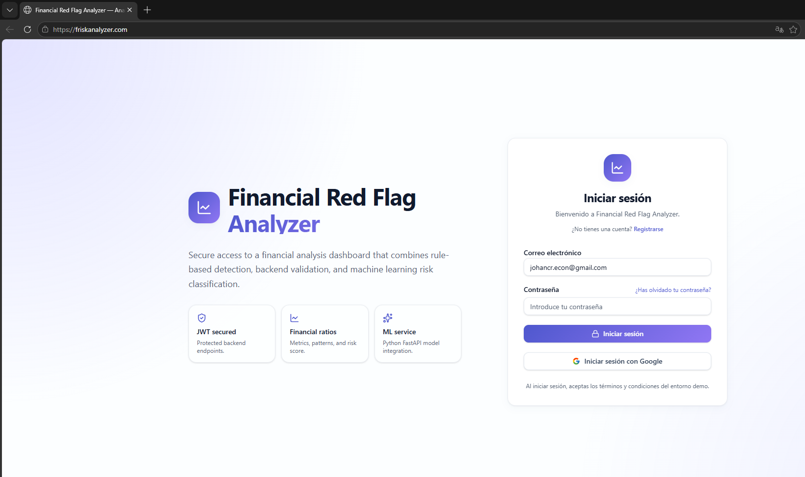
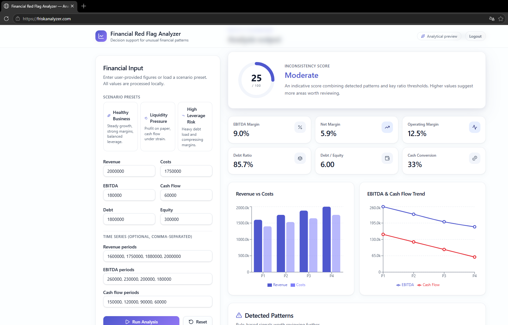
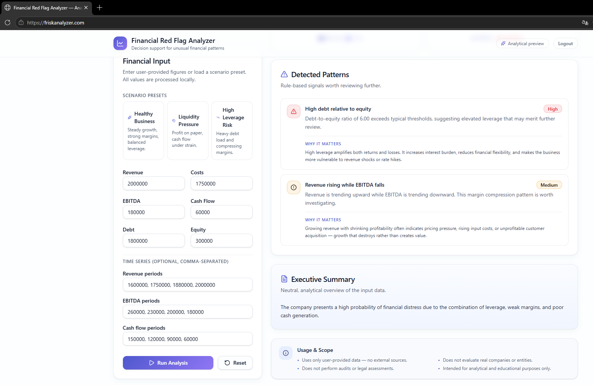
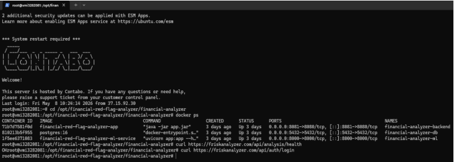
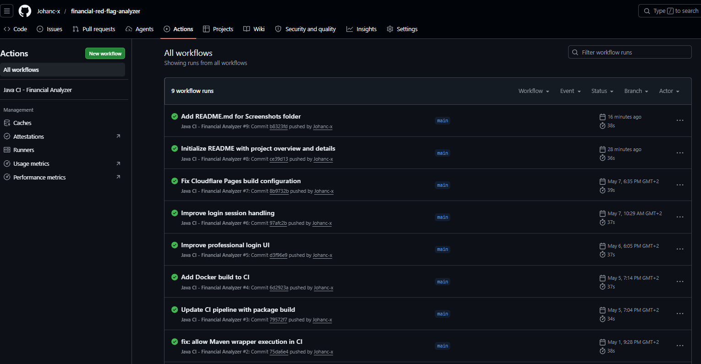

# Financial Red Flag Analyzer

Web-based financial analysis platform that identifies unusual financial patterns and inconsistency signals in user-provided financial data.

Live demo: https://friskanalyzer.com

## Overview 

Financial Red Flag Analyzer is a full-stack financial analysis platform designed to evaluate user-provided financial figures, calculate key financial ratios, detect unusual patterns, and generate an explanatory risk-oriented output.

The system combines a React frontend, a Spring Boot backend, PostgreSQL persistence, JWT authentication, Dockerized services, and a Python-based ML service prepared for future model expansion.

## Key Features 

- Secure login system with JWT authentication.
- BCrypt password encryption.
- Financial input form with scenario presets.
- Rule-based financial pattern detection.
- Risk scoring and analytical output.
- Executive summary generation.
- Dockerized backend, database and ML service.
- PostgreSQL database integration.
- Nginx reverse proxy with HTTPS.
- CI pipeline with GitHub Actions.
- Production deployment on a Linux VPS.

## Live Demo

The application is deployed and accessible at:

https://friskanalyzer.com

Demo credentials can be provided upon request.

## Architecture

The project follows a modular full-stack architecture:

Frontend:
- React / TypeScript
- Vite
- Tailwind CSS / UI components

Backend:
- Java Spring Boot REST API
- Spring Security
- JWT authentication
- BCrypt password hashing

Database:
- PostgreSQL
- User and analysis history persistence

ML Service:
- Python FastAPI microservice
- Prepared for financial risk model integration

Infrastructure:
- Docker Compose
- Nginx reverse proxy
- HTTPS with Let's Encrypt
- Linux VPS deployment
- GitHub Actions CI workflow

  User Browser
   ↓
React Frontend
   ↓
Nginx Reverse Proxy
   ↓
Spring Boot API
   ↓
PostgreSQL Database

Spring Boot API
   ↓
Python ML Service

## Financial Analysis Logic

The system evaluates financial inputs such as revenue, costs, EBITDA, cash flow, debt, and equity. Based on these values, it calculates indicators including:

- EBITDA margin
- Net margin
- Operating margin
- Debt ratio
- Debt-to-equity ratio
- Cash conversion

The platform then detects patterns such as:

- High debt relative to equity
- Revenue growth with declining EBITDA
- Margin compression
- Liquidity pressure
- Weak cash generation

## Security

This project implements a secure authentication flow using:

- JWT-based authentication
- BCrypt password hashing
- Protected backend endpoints
- HTTPS deployment
- CORS configuration for production domain
- Reverse proxy through Nginx

## Deployment

The application was deployed on a Linux VPS using Docker Compose and Nginx.

The deployment includes:

- Frontend served through Vite/Nginx proxy
- Spring Boot backend container
- PostgreSQL container
- Python ML service container
- HTTPS certificate with Let's Encrypt
- Domain configuration

## CI/CD

The repository includes GitHub Actions workflows to validate the Java backend build process.

Current CI checks include:

- Maven build
- Package validation
- Docker build preparation

## Screenshots

### Login Page

### Financial Dashboard

### Detected Patterns

### Dockerized Services

### GitHub Actions

## How to Run Locally

### Prerequisites

- Node.js
- Java 17
- Maven
- Docker
- Docker Compose

### Clone the repository

git clone https://github.com/Johanc-x/financial-red-flag-analyzer.git
cd financial-red-flag-analyzer

### Start backend services

cd financial-analyzer
docker compose up -d

### Start frontend

cd ..
npm install
npm run dev

## Current Status

This project is currently in V1 / MVP stage.

The current version includes authentication, financial analysis, pattern detection, containerized services, and production deployment.

Some advanced features are still under development.

## Future Improvements

- Enable public user registration.
- Add role-based access control.
- Expand the ML service with real predictive models.
- Store and visualize user analysis history.
- Add more financial endpoints.
- Improve monitoring and logging.
- Add automated deployment pipeline.
- Add unit and integration tests for frontend and backend.
- Improve security hardening for production.

## Tech Stack

- React
- TypeScript
- Vite
- Java
- Spring Boot
- Spring Security
- JWT
- BCrypt
- PostgreSQL
- Python
- FastAPI
- Docker
- Docker Compose
- Nginx
- Linux VPS
- GitHub Actions

